# Goals

- Explain what needs to be done to achieve the Level 2 on a RESTFUL API
  on the Richardson Maturity Model.
- Implement a Level 2 Users RESTFUL API Microservice.
- Implement a Level 2 Tasks RESTFUL API Microservice.
- User dependencies injections to create a decoupled architecture.

# Growth Mindset
"Individuals who believe their talents can be developed (through hard work, good strategies, and input from others) have a growth mindset. They tend to achieve more than those with a more fixed mindset (those who believe their talents are innate gifts)" What Having a "Growth Mindset" Actually means - Harvard Business Review
# MaIn Topics

- Microservices.
- RESTFUL API.
- Richardson Maturity Model.
- Dependencies Injection.

# Codelab 🤹🏽
🗣️ "I hear and I forget I see and I remember I do and I understand." Confucius
## Part 1: Implementing the Users Microservice RESTFUL API

1. Create a new project using the Spring Initializr .
2. Use either **Java** or **Kotlin** as programming language.
3. Use **Gradle** as project option (if your computer is slow then use
   Maven).
4. Add Spring Web dependency before generating the project.
5. Use latest Spring Boot version (make sure your selection doesn't
   contain SNAPSHOT or M1 (those are probably not as stable as the rest).
6. Click on generate.
7. Go to your Github  account.
8. Create a new public repo, name it as you like.
9. Commit/push the files generated in 7.
10. Open the project on favorite editor (IntelliJ IDEA is highly
    recommended throughout this course).
11. Create a new package called ***dto*** and inside define your ***UserDto***
    object with at least the following fields:

    - name
    - email
    - lastName
    
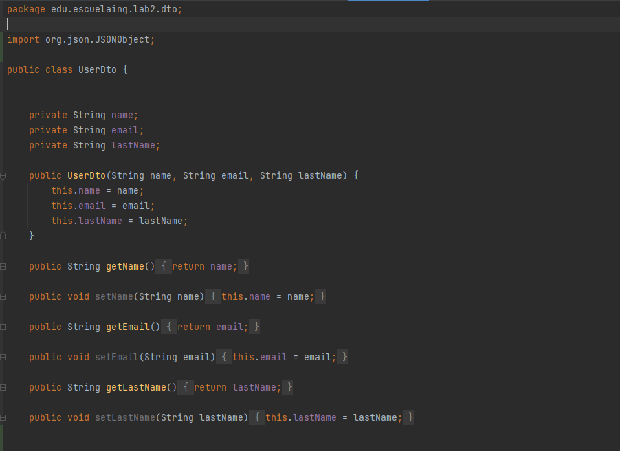

12. Create a new package called ***data*** and inside define your ***User*** data object with at least the following fields (Types don't matter yet, just be sure both DTO classes and Data classes types are consistent enough):
    - id
    - name
    - email
    - lastName
    - createdAt
    
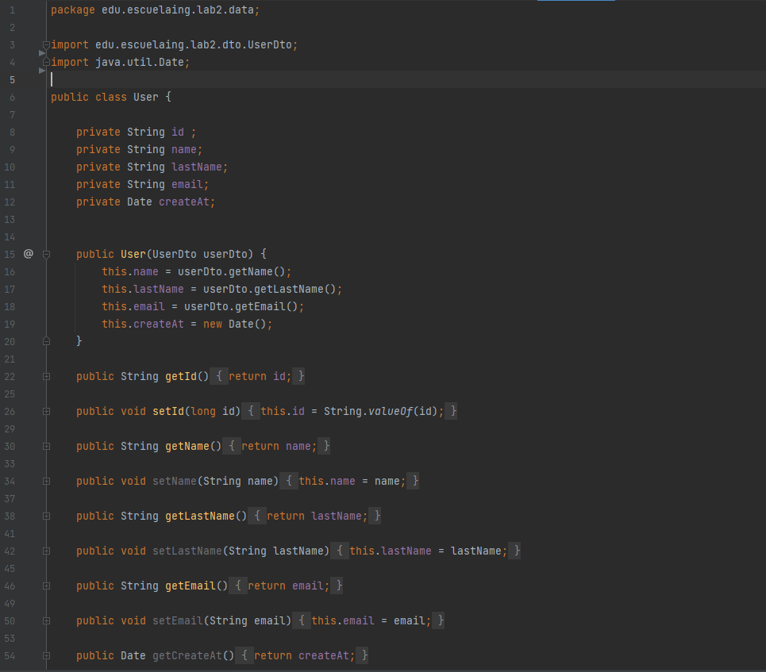

13. Create a new package called ***service*** and inside create the following interface:

    ```java
     public interface UserService
     {
         User create( User user );

         User findById( String id );
         
         List<User> getAll();

         void deleteById( String id );

         User update( User user, String userId );
     }  
14. Create an implementation of the ***UserService*** using a HashMap data structure inside.
15. Make your service implementation ***UserServiceHashMap*** injectable using the ***@Service*** annotation.

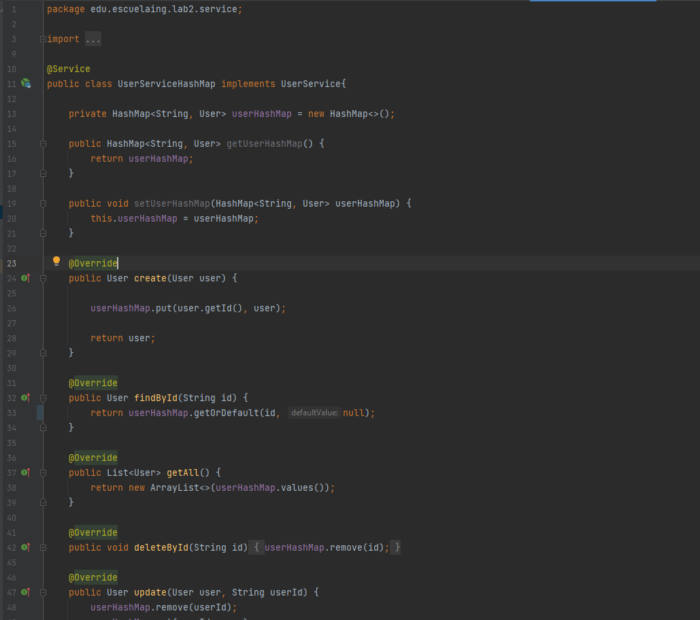

17. Create a new package called ***controller*** and create a new class ***UserController*** inside.
18. Annotate your ***UserController*** so it becomes a ***REST*** Controller:

    ```java
     @RestController
     @RequestMapping( "/v1/user" )
     public class UserController
     {
     }  
19. Inject your ***UserService*** implementation inside the ***UserController*** via the constructor:
    ```java
     @RestController
     @RequestMapping( "/v1/user" )
     public class UserController {
         private final UserService userService;

         public UserController(@Autowired UserService userService) {
             this.userService = userService;
         }
     }  
20. Implement all the endpoints needed to interact with you  _UserService_. Use the following method signatures to help you achieve the Level 2 RESTFUL Maturity:
   ```java
@RestController
@RequestMapping( "/v1/user" )
public class UserController {
  
	    private final UserService userService;

	    public UserController(@Autowired UserService userService ) {
	        this.userService = userService;
	    }


	    @GetMapping
	    public ResponseEntity<List<User>> getAll() {
	        //TODO implement this method using UserService
	        return null;
	    }
	   
	    @GetMapping( "/{id}" )
	    public ResponseEntity<User> findById( @PathVariable String id ) {
	       //TODO implement this method using UserService
	       return null;
	    }
	   
	   
	    @PostMapping
	    public ResponseEntity<User> create( @RequestBody UserDto userDto ) {
	         //TODO implement this method using UserService
	         return null;
	    }
	   
	    @PutMapping( "/{id}" )
	    public ResponseEntity<User> update( @RequestBody UserDto userDto, @PathVariable String id ) {
	         //TODO implement this method using UserService
	         return null;
	    }

	    @DeleteMapping( "/{id}" )
	    public ResponseEntity<Boolean> delete( @PathVariable String id ) {
	         //TODO implement this method using UserService
	        return null;      
	    }
  }
 ```
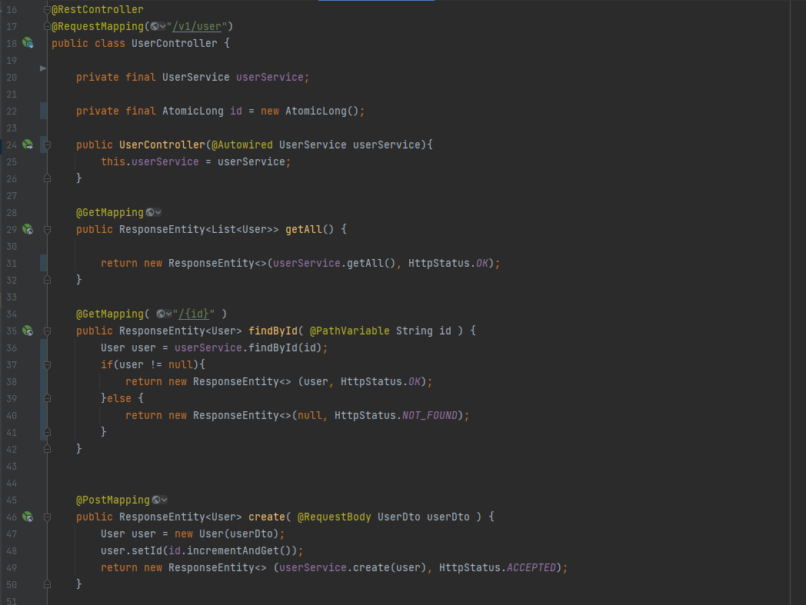

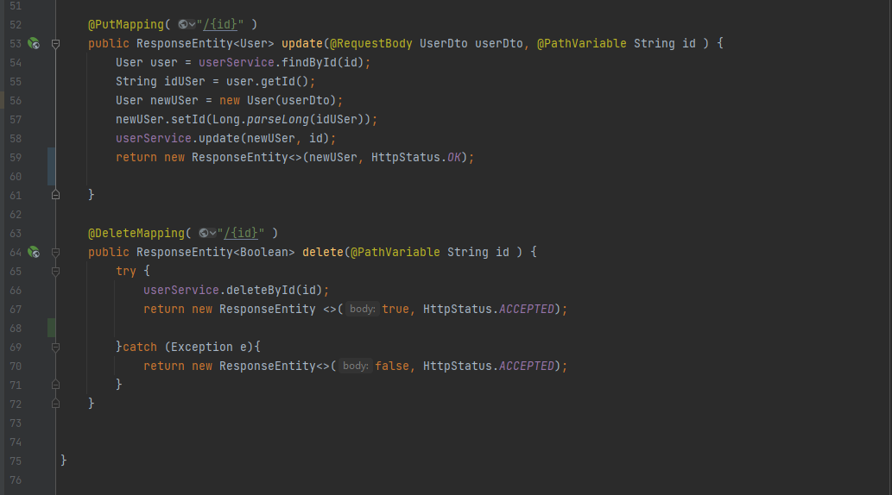

20. Build / Run your project.

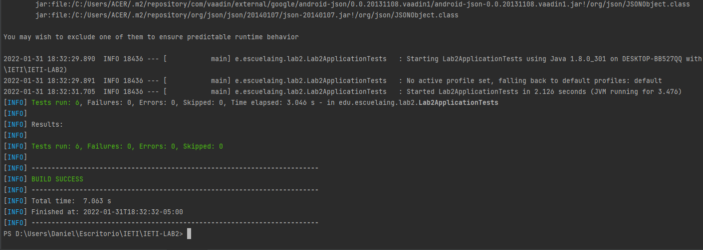

21. Download and install [Insomnia](https://insomnia.rest/download) and test ALL the endpoints of your API.
    

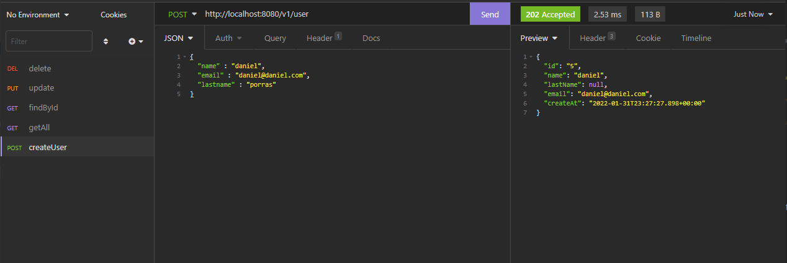
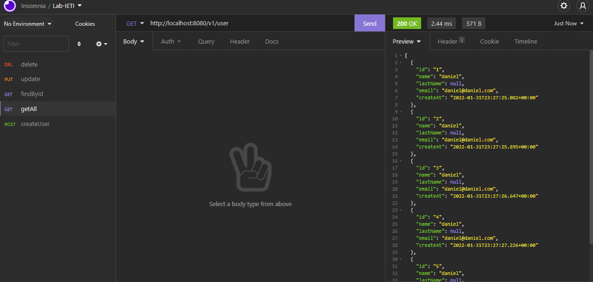
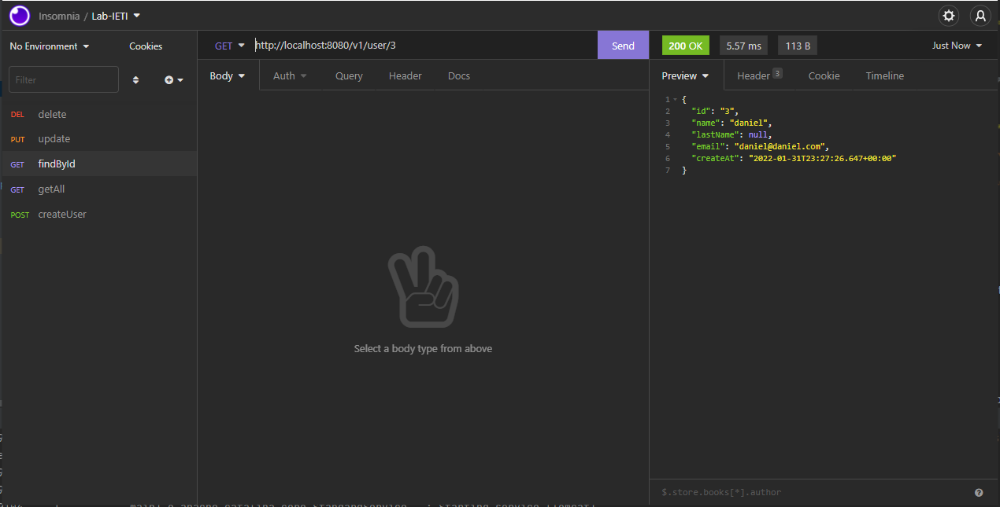
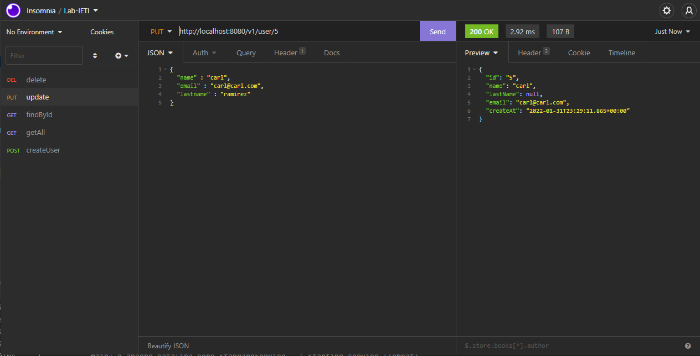
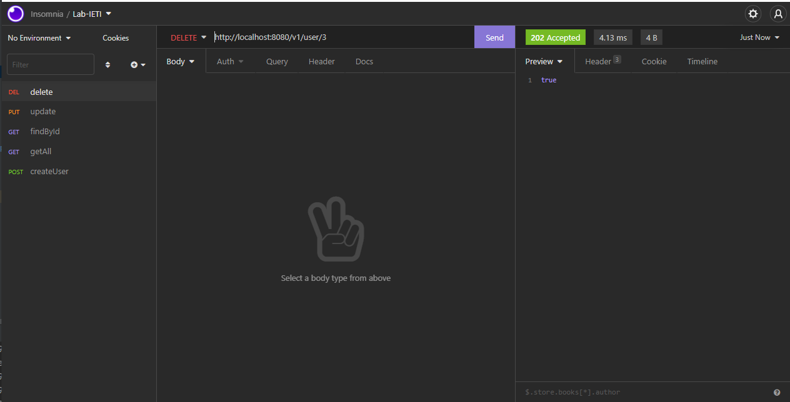


### Part 1: Creating your Atlas account and first cluster:

If you haven't created your MongoDB Cluster follow part 1 - 4:

* [Get Started with Atlas](https://docs.atlas.mongodb.com/getting-started/)

### Part 2: Connecting my MongoDB Cluster with Spring Boot

1. Login into your [MongoDB Atlas account](https://account.mongodb.com/account/login)
2. Click *connect* on the cluster you created on Part 1:
   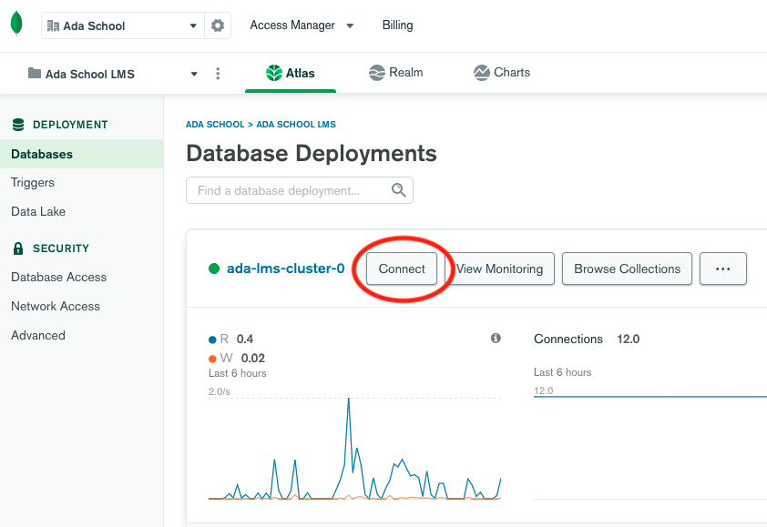
3. Select *Connect your application*:
   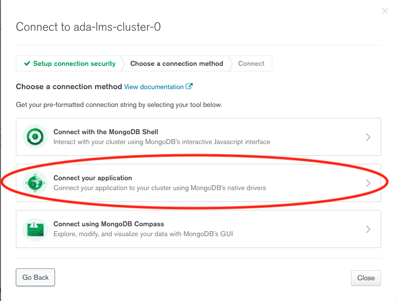
4. Choose the *Java* driver, select the latest version and copy the *connection string*:
   
5. Replace the *password* on the *connection string* with the password used when creating your database user.
6. Add an *Environment Variable* to the *application.properties* file to store the MongoDB URI:
    ````properties
    spring.data.mongodb.uri=${MONGODB_URI}
    ````
7. Add the environment variable to IntelliJ Idea by editing the Run/Debug Configurations:
   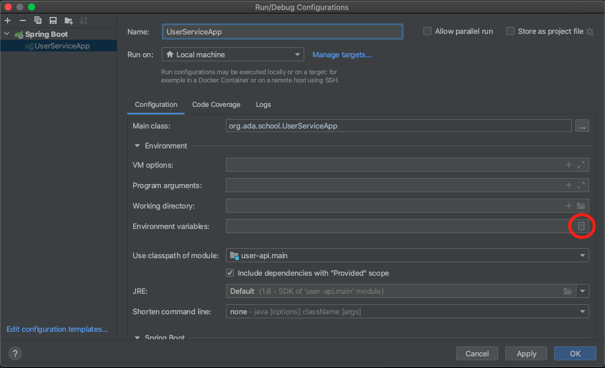


   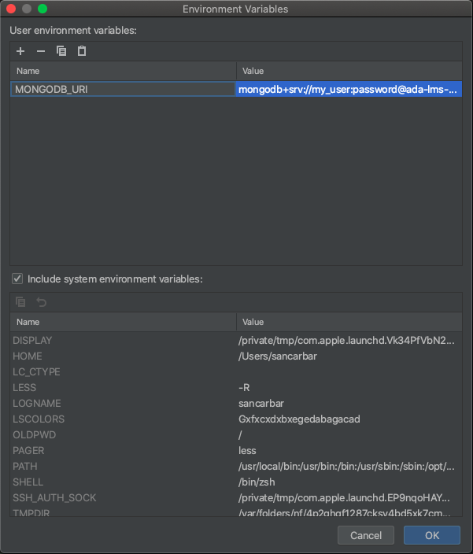
7. Add the Spring Boot starter data MongoDB dependency to your *build.gradle*:
    ```groovy
       dependencies {
            implementation 'org.springframework.boot:spring-boot-starter-web'
            implementation 'org.springframework.boot:spring-boot-starter-data-mongodb'
            testImplementation 'org.springframework.boot:spring-boot-starter-test'
        }
    ```
8. Run your project and verify that the connection is successful.

### Part 3: Implementing the MongoDB Service

1. Create a new package called *repository*.
2. Modify your current **User** class to use MongoDB notations:

    ```java
      import org.springframework.data.annotation.Id;
      import org.springframework.data.mongodb.core.index.Indexed;
      import org.springframework.data.mongodb.core.mapping.Document;
      
      import java.util.Date;
      
      @Document
      public class User
      {
         @Id
         String id;
      
         String name;
      
         @Indexed( unique = true )
         String email;
      
         String lastName;
      
         Date createdAt;
      
         public User()
         {
         }
      }
   
     ```
    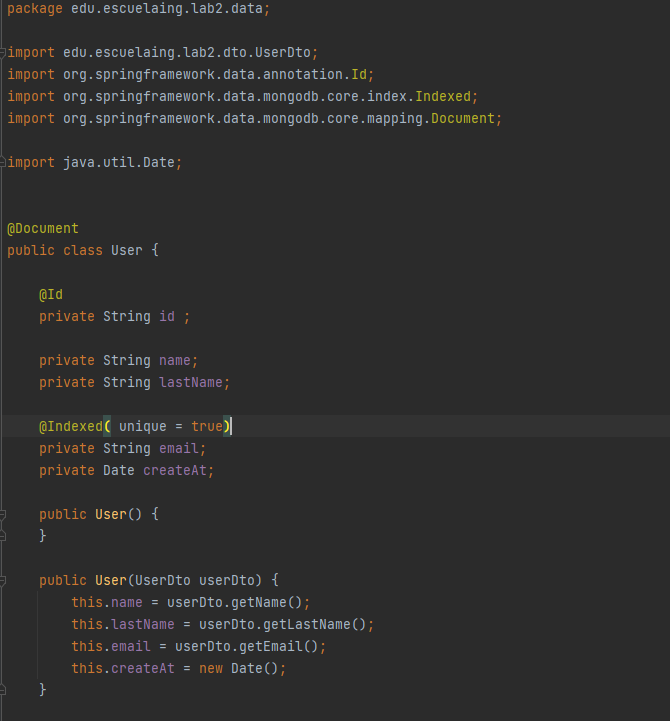   


3. Create a new interface called *UserRepository* inside the repository package:
    ```java
      import org.springframework.data.mongodb.repository.MongoRepository;
      
      public interface UserRepository extends MongoRepository<User, String>
      {}
     ```
   
    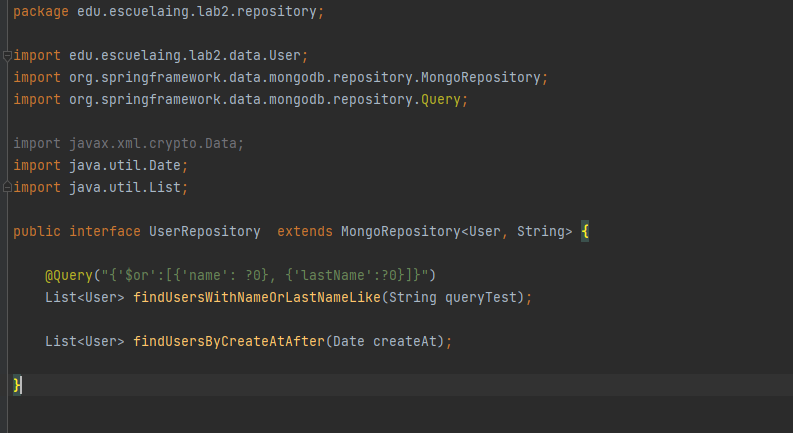

4. Create a new *UserService* implementation called *UserServiceMongoDB* and inject inside the *UserRepository*:

      ```java
         import java.util.List;
         
         public class UserServiceMongoDB
         implements UserService
         {
         
             private final UserRepository userRepository;
         
             public UserServiceMongoDB(@Autowired UserRepository userRepository )
             {
                 this.userRepository = userRepository;
             }
         
             @Override
             public User create( User user )
             {
                 return null;
             }
         
             @Override
             public User findById( String id )
             {
                 return null;
             }
         
             @Override
             public List<User> all()
             {
                 return null;
             }
         
             @Override
             public boolean deleteById( String id )
             {
                 return false;
             }
         
             @Override
             public User update( UserDto userDto, String id )
             {
                 return null;
             }
         }
    ```
    
5. Implement the methods of the *UserServiceMongoDB* using the *UserRepository*.
6. Remove the *@Service* annotation from the *UserServiceHashMap* and add it to the *UserServiceMongoDB*.

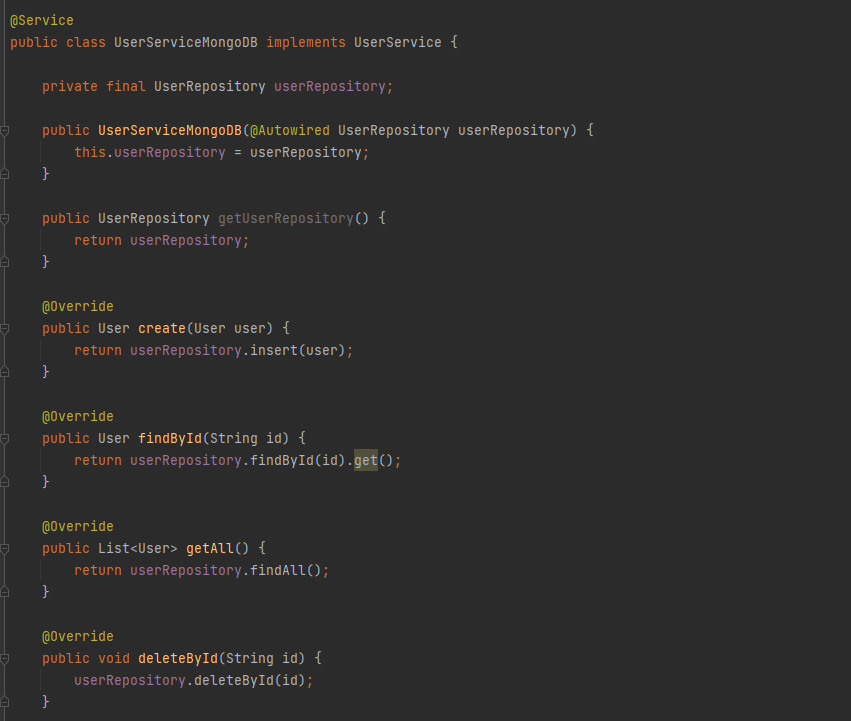
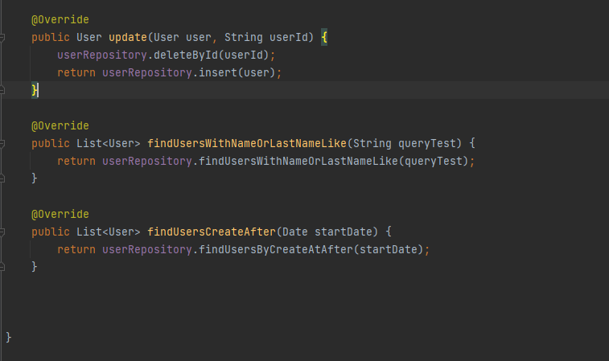


7. Test your API and verify that your data is stored in your cluster.

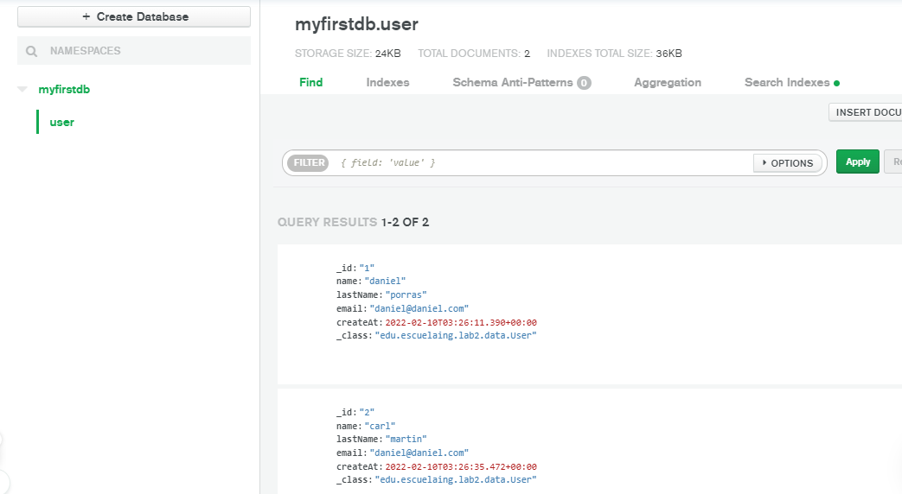


### Challenge Yourself: Implement complex queries using the Spring Data Query Methods
1. Modify the *UserService* interface adding the following methods:
    ```java
        List<User> findUsersWithNameOrLastNameLike(String queryText);
        
        List<User> findUsersCreatedAfter(Date startDate);
      {}
     ```

2. Add those 2 new mapping methods on the controller.
3. Test your API, verify that queries work.


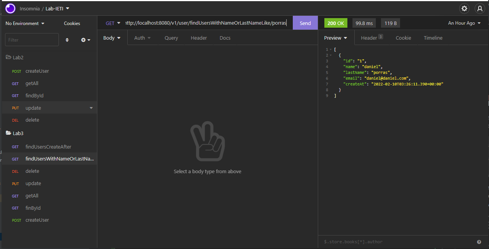
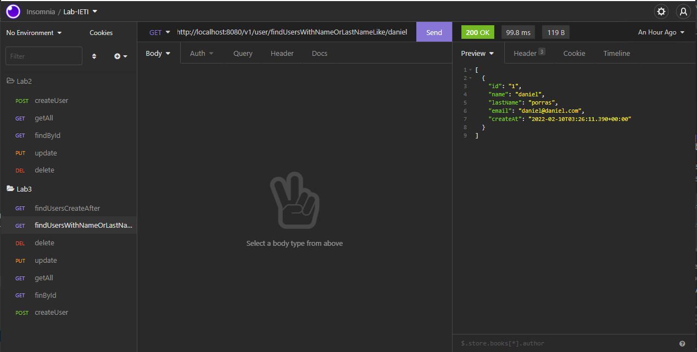


***Tip***: take a look at the official documentation and learn how to create custom queries with [Spring Data](https://docs.spring.io/spring-data/jpa/docs/current/reference/html/#jpa.query-methods.query-creation)

